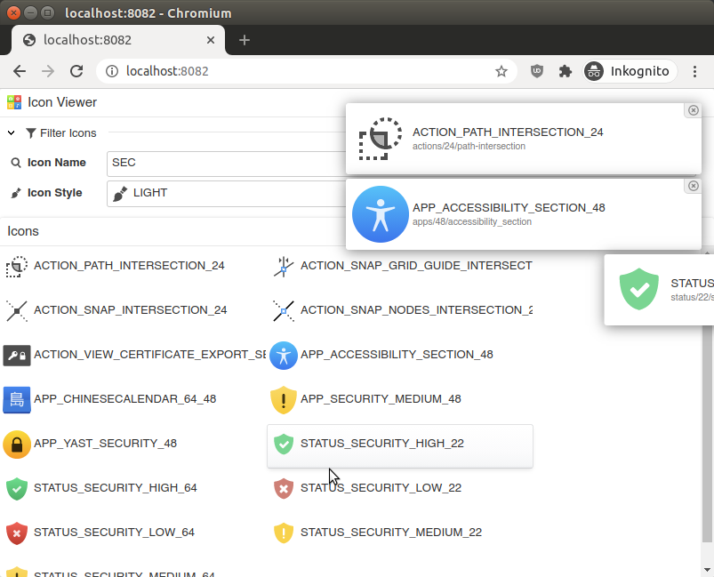

# Teamapps Icon Provider for Antu Classic Icons

This Icon set contains 3582 SVG icons and two styles `LIGHT`(default) and `DARK` for Dark Backgrounds. 

The original purpose of this collection is a for a Linux Desktop Operating System. 
Because of this, it contains icons with different styles and sizes and duplicated icons.
For example, there are icons for Application Launcher that are designed for bigger sizes. 
`AntuIcon.APPLET_BINARYCLOCK_256` 

Other icons are designed for small status icons or action buttons in toolbars in specific applications.  `AntuIcon.ACTION_CONTRAST_24`

`AntuIcon.STATUS_MIC_OFF_22`

The number of at the end of an icon ID is the originally intended size. 

Icons Source: <https://github.com/fabianalexisinostroza/Antu-classic>

The Icons are in various Categories:

* `AntuIcon.ACTION_*`: 1471 icons
* `AntuIcon.APPLET_*`: 55 icons
* `AntuIcon.APP_*`: 1498 icons
* `AntuIcon.CATEGORY_*`: 32 icons
* `AntuIcon.DEVICE_*`: 70 icons
* `AntuIcon.EMBLEM_*`: 21 icons
* `AntuIcon.EMOTE_*`: 32 icons
* `AntuIcon.PLACE_*`: 270 icons
* `AntuIcon.STATUS_*`: 136 icons

Mimetype Icons of the Antu Theme are excluded

## Usage

Add dependency to your TeamApps Maven Project:

~~~xml
        <dependency>
            <groupId>org.teamapps</groupId>
            <artifactId>teamapps-antu-icon-provider</artifactId>
            <version>1.1.0</version>
        </dependency>
~~~

Usage:

~~~java
import org.teamapps.icons.Icon;
import org.teamapps.icon.antu.AntuIcon;
import org.teamapps.icon.antu.AntuIconStyle;

public class IconExample {
    public static Void someMethod() {
        Icon icon1 = AntuIcon.STATUS_SECURITY_HIGH_64;
        Icon icon2 = AntuIcon.STATUS_MIC_OFF_22.withStyle(AntuIconStyle.DARK);
        Icon icon3 = AntuIcon.ACTION_AUTOCORRECTION_32.withStyle(AntuIconStyle.LIGHT); // Default Style
    }
}
~~~

## Antu Icon Browser

This Project includes a visual Icon Browser.

Start `AntuIconBrowser.main()` in this project or start it from your Teamapps project

`Component antuIconBrowser = new AntuIconBrowser(sessionContext).getUI();`

Complete IconBrowser class. Start and point your browser to http://localhost:8082
~~~java
import org.teamapps.icon.antu.AntuIconBrowser;
import org.teamapps.server.jetty.embedded.TeamAppsJettyEmbeddedServer;
import org.teamapps.ux.component.Component;
import org.teamapps.ux.component.rootpanel.RootPanel;
import org.teamapps.webcontroller.WebController;

public class IconBrowser {
    public static void main(String[] args) throws Exception {
        WebController controller = sessionContext -> {
            RootPanel rootPanel = new RootPanel();
            sessionContext.addRootPanel(null, rootPanel);
            Component antuIconBrowser = new AntuIconBrowser(sessionContext).getUI();
            rootPanel.setContent(antuIconBrowser);
        };
        new TeamAppsJettyEmbeddedServer(controller, 8082).start();
    }
}
~~~

## Creation Notes

Sync Icons:

~~~bash
# clone antu-classic repository to directory beside teamapps-antu-icon-provider
git clone https://github.com/fabianalexisinostroza/Antu-classic ../antu-classic

# sync content without .git and mimetype icons to resources, exclude duplicate folders
rsync -a --delete  --delete-excluded \
  --exclude .git \
  --exclude /*/mimetypes/ \
  --exclude /*/actions/16 \
  --exclude /*/actions/22 \
  --exclude /*/devices/16 \
  --exclude /*/places/16 \
  --exclude /*/status/16 \
  --exclude /AntuExtras \
  ../antu-classic/ src/main/resources/org/teamapps/icon/antu-classic/

cd src/main/resources/org/teamapps/icon/antu-classic/
find Antu -name '*.svg' -type f
~~~

Enum naming regex

~~~bash
((\D+__)(\d\d)__(.*)\.svg)
$4_$3
~~~

## SVG Optimization

The original SVGs (with some fixes/renaming and deletions) are in the folder `antu-classic` for reference, the optimized SVG file resources used by this provider are in `src/main/resources/org/teamapps/icon/antu`

optimze SVGs
~~~bash
alias optimizesvg="scour --strip-xml-prolog --remove-metadata --remove-descriptions --remove-titles --strip-xml-space  --no-line-breaks  --shorten-ids --enable-id-stripping --set-precision 4"
for svg in Antu/apps/**/*.svg ; do echo $svg optimizesvg $svg > ../antu/$svg || echo ERROR: $svg > ./error.log ;done
~~~

TODO: check. There are some icon files that are only in AntuDark, but they are not all for a dark theme:

- actions/24/branch.svg
- actions/24/diag_class.svg
- actions/24/entry-delete.svg
- actions/24/entry-edit.svg
- actions/24/generalisation.svg
- actions/24/password-show-on.svg
- actions/24/snap-bounding-box.svg
- actions/24/umbrello_diagram_entityrelationship.svg

## TEAMAPPS SOFTWARE LICENSE

Apache 2.0

## ANTU ICONS LICENSE

LGPL, GNU LESSER GENERAL PUBLIC LICENSE Version 2.1 <https://github.com/fabianalexisinostroza/Antu-classic/blob/master/LICENSE.md>